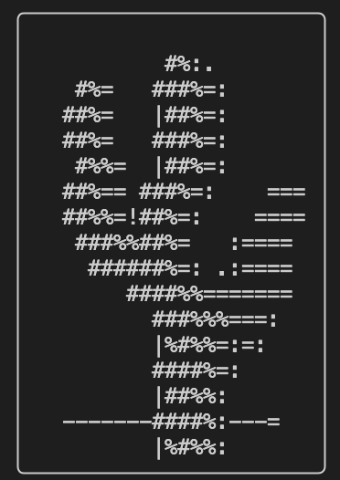
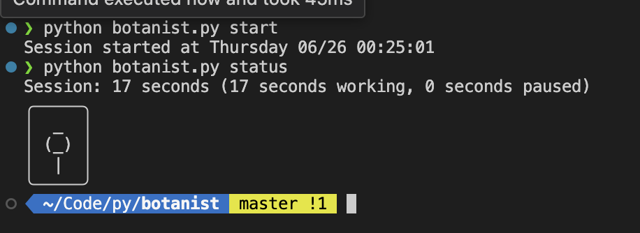
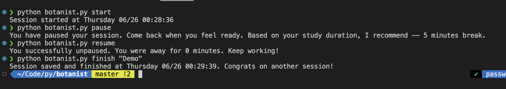
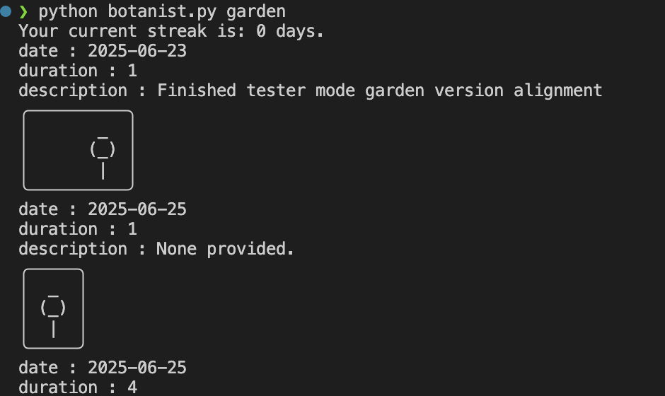

<p align="center">
  
</p>

# Botanist 🌱

A command-line time tracker that rewards your focus with a growing ASCII garden.

## What is Botanist?

Botanist gamifies time tracking by growing different flowers based on your session length. The longer you focus, the more beautiful your flower becomes.

## Features

- ⏱️ Track work sessions with `start` and `finish`
- ⏸️ Pause and resume sessions 
- 🌼 Earn ASCII flowers based on focus duration
- 📊 Export your data as CSV for analysis
- 🌻 View your garden of completed sessions
- 📝 Optional Obsidian integration

## Installation

```bash
git clone https://github.com/rigelshasani/botanist.git
cd botanist

## Usage

Start tracking:
```bash
python botanist.py start
```
Take a break:
```bash
python botanist.py pause
```
Resume working:
```bash
python botanist.py resume
```
Finish and save your session:
```bash
python botanist.py finish "Completed Python exercises"
```
Check current session status:
```bash
python botanist.py status
```
View your garden:
```bash
python botanist.py garden
```
Export to CSV:
```bash
python botanist.py export
```

## Screenshots





## Flower Rewards
Your focus duration determines which flower you grow:
< 25 minutes: Seedling
```bash
   _
  (_)
   |
```
25-45 minutes: Sprout
```bash
  (@)
   |
```
45-60 minutes: Bud
```bash
  .-. 
 ( + )
  |*|
```
60+ minutes: Full Bloom
```bash
  #%:.     
  #%=   ###%=:    
 ##%=   |##%=:    
 ##%=   ###%=:    
  #%%=  |##%=:    
  ##%== ###%=:    ===
   ##%%=!##%=:    ====
    ###%%##%=   :==== 
     ######%=: .:==== 
      ####%%======= 
        ###%%%===: 
         |%#%%=:=:  
         ####%=:   
         |##%%:    
  -------####%:---=
         |%#%%:
```
Optional: Obsidian Integration
To save sessions to Obsidian, set the environment variable:
```bash
export BOTANIST_OBSIDIAN_PATH="/path/to/your/obsidian/file.md"
```
Add this to your ~/.zshrc or ~/.bashrc to make it permanent.