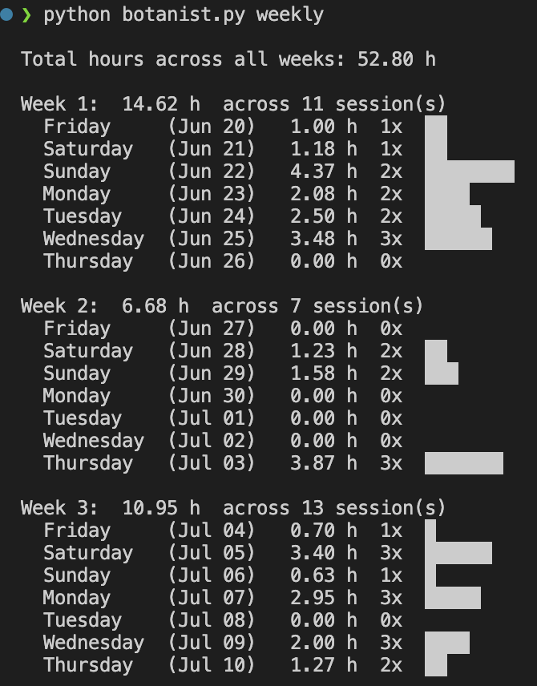

<p align="center">
  
</p>

# Botanist 🌱

A command-line time tracker that rewards your focus with a growing ASCII garden featuring beautiful, artistic flowers.

## What is Botanist?

Botanist gamifies productivity by growing increasingly elaborate ASCII flowers based on your focus duration. From simple seedlings to cosmic legendary blooms, each session earns you visual rewards that reflect your dedication. Features advanced analytics, modular architecture, and seamless Obsidian integration.

## Features

**⏱️ Time Tracking**
- Start, pause, resume, and finish work sessions
- ASCII art feedback for session start/completion
- Configurable time thresholds for flower rewards
- Input sanitization for secure descriptions

**🌸 Artistic Flower System** 
- 20+ unique, symmetrical ASCII flowers
- Progressive rarity: Eastern → Geometric → Mystical → Legendary
- Ultimate "Universe Garden" for 3+ hour sessions
- Beautiful visual rewards that scale with dedication

**📊 Analytics & Insights**
- Weekly productivity analysis with visual bars
- Daily and weekly goal tracking with progress visualization
- Session export to CSV for custom analysis  
- Complete garden view of all completed sessions
- Duration tracking with pause/resume support

**🛡️ Security & Reliability**
- Input sanitization prevents injection attacks
- Modular, maintainable codebase
- Configurable settings stored in JSON
- Comprehensive error handling

**🔗 Integrations**
- Seamless Obsidian markdown logging
- Clean formatting without extra spacing
- Environment-based configuration
- Cross-platform compatibility

## Installation

```bash
git clone https://github.com/rigelshasani/botanist.git
cd botanist
```

## Usage

```bash
# Basic Session Management
python botanist.py start                          # Start tracking
python botanist.py pause                          # Take a break
python botanist.py resume                         # Resume working
python botanist.py finish "Finished Python Drill" # Finish and save

# Monitoring & Analysis  
python botanist.py status                         # Check current session
python botanist.py garden                         # View your garden
python botanist.py weekly                         # Weekly productivity report
python botanist.py export                         # Export to CSV

# Configuration & Goals
python botanist.py config                         # View current settings  
python botanist.py config weekly=25              # Set weekly goal to 25 hours
python botanist.py goals                          # View daily/weekly progress
python botanist.py test                           # Test flower display
```

## Screenshots


---


---


---



---


## 🌼 Flower Progression System

Botanist features a sophisticated flower reward system with 20+ unique, artistic flowers that become increasingly elaborate as your focus sessions grow longer. Each tier offers beautiful, symmetrical designs that serve as visual rewards for your dedication.

### Progression Tiers

**🌱 Basic (< 60 min)**
- Seedling, Bud, Bloom - Simple, clean designs for shorter sessions

**🌸 Traditional Eastern (60-90 min)**  
- Lotus varieties, Chrysanthemum, Plum Blossom, Cherry Blossom
- Beautiful cultural flowers with perfect symmetry

**✨ Artistic Geometric (90-120 min)**
- Mandala Flower, Crystal Bloom, Geometric Rose, Starburst
- Complex mathematical patterns and artistic designs

**🔮 Mystical Rare (120-150 min)**
- Phoenix Feather, Dragon Scale, Celestial Lotus, Infinity Bloom
- Rare flowers featuring special Unicode symbols

**⚡ Legendary (150-180 min)**
- World Tree, Cosmic Flower, Eternal Flame
- Epic multi-line designs with grand titles

**🌌 Ultimate (180+ min)**
- Universe Garden - The most elaborate cosmic flower for 3+ hour sessions

### Example Flowers

**Mandala Flower** (Geometric Tier)
```
    .--*--.    
  .*'     '*.  
 *'  .---.  '*
*   ( *** )   *
|    '***'    |
*   ( *** )   *
 *. '-----' .*
  '*.     .*'  
    '--*--'    
       |       
```

**Universe Garden** (Ultimate Tier)
```
           ✧ ★ ✦ ★ ✧           
      ★ ✦ ✧ ◊ ◊ ◊ ✧ ✦ ★      
   ✦ ◊ ◊ ◊ ◊ ◊ ◊ ◊ ◊ ◊ ✦   
 ★ ◊ ◊ ◊ ◊ ◊◊◊ ◊ ◊ ◊ ◊ ★ 
✧ ◊ ◊ ◊ ◊ ◊◊◊◊◊ ◊ ◊ ◊ ◊ ✧
 ★ ◊ ◊ ◊ ◊◊◊***◊◊◊ ◊ ◊ ◊ ★
✧ ◊ ◊ ◊ ◊ ◊◊◊◊◊ ◊ ◊ ◊ ◊ ✧
 ★ ◊ ◊ ◊ ◊ ◊◊◊ ◊ ◊ ◊ ◊ ★ 
   ✦ ◊ ◊ ◊ ◊ ◊ ◊ ◊ ◊ ◊ ✦   
      ★ ✦ ✧ ◊ ◊ ◊ ✧ ✦ ★      
           ✧ ★ ✦ ★ ✧           
     =======================   
        UNIVERSE GARDEN        
     =======================   
```

The longer you focus, the cooler your flower becomes!

## Optional: Obsidian Integration

To automatically append finished session logs to your Obsidian notes:

```bash
export BOTANIST_OBSIDIAN_PATH="/path/to/your/obsidian/file.md"
```

Add this line to your `~/.zshrc`, `~/.bashrc`, or `~/.profile` to persist the setting.

## Configuration

Botanist stores configuration in `.botanist_config.json`:

```json
{
  "time_thresholds": {
    "seedling_minutes": 25,
    "bud_minutes": 45,
    "bloom_minutes": 60,
    "queen_minutes": 120
  },
  "min_session_seconds": 30
}
```

Use `python botanist.py config` to view current settings and `config weekly=N` to set weekly goals.

## Data Format

Sessions are stored in `.hiddenGarden.json`:

```json
{
  "current_streak": 0,
  "sessions": [{
    "date": "2025-07-18",
    "start_time": "2025-07-18 10:22:12", 
    "end_time": "2025-07-18 12:28:28",
    "duration": 7576.38,
    "description": "Python development",
    "flower": "(Beautiful ASCII art flower)"
  }]
}
```

## Weekly Analysis Output Example

```
Week 4:  16.37 h
  Friday     (Jul 11)   2.57 h  █████
  Saturday   (Jul 12)   1.87 h  ███
  Sunday     (Jul 13)   2.63 h  █████
  ...
Total hours across all weeks: 45.12 h
```

## Goals System

Track your productivity with weekly targets and visual progress bars:

```
╔════════════════════════════════════════╗
║            TODAY'S PROGRESS            ║
╚════════════════════════════════════════╝

📅 2025-09-03
⏱️  Focus Time: 271 minutes (4.5 hours)
🎯 Sessions: 3 completed

╔════════════════════════════════════════╗
║           WEEKLY PROGRESS              ║
╚════════════════════════════════════════╝

📅 Week: 2025-09-01 to 2025-09-07

⏱️  Focus Time: 827/1500 minutes (55%)
   [████████████████░░░░░░░░░░░░░░] 💪

🎯 Sessions: 12/15 completed (80%)
   [████████████████████████░░░░░░] 🔥

📈 Keep going! Need 673 more minutes and 3 more sessions.
```

## Architecture

Botanist now features a clean, modular architecture:

```
botanist_pkg/
├── session.py      # Session management and time tracking
├── flowers.py      # Artistic flower definitions and assignment
├── display.py      # ASCII art rendering and visual output
├── analytics.py    # Weekly analysis and statistics
├── garden.py       # Data persistence and CSV export
├── goals.py        # Weekly productivity goals and progress tracking
├── config.py       # Configuration management
└── utils.py        # Input sanitization and validation
```

## Security Features

- **Input Sanitization**: All user descriptions are sanitized to prevent injection attacks
- **Length Limits**: Descriptions limited to 200 characters to prevent abuse
- **Safe Characters**: Only alphanumeric and common punctuation allowed
- **Configuration Validation**: Time inputs validated within reasonable ranges

## Contributing

Botanist is built with security, modularity, and maintainability in mind. The codebase features:
- Comprehensive documentation and inline comments
- Modular design with clear separation of concerns  
- Input validation and error handling
- Configurable settings for customization

---

**Botanist was built to make your work bloom. Focus hard, and let your flowers speak for your dedication.** 🌱✨